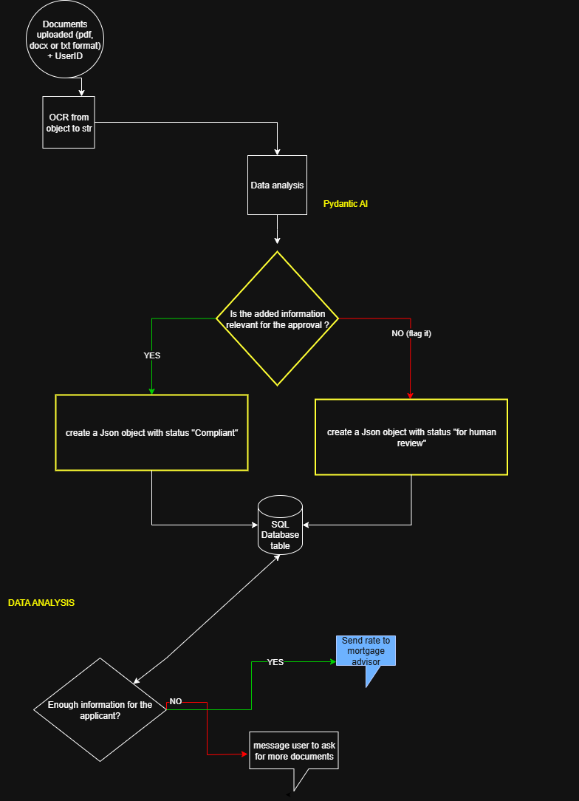

# AI-Powered Mortgage Analysis System

## Project Overview

The AI-Powered Mortgage Analysis System is a comprehensive solution designed to revolutionize mortgage document processing and income verification. This system leverages advanced artificial intelligence technologies including Optical Character Recognition (OCR), and Large Language Model calls to automate the traditionally manual and time-intensive mortgage application review process.

## Key Features

- **Intelligent Document Upload**: Secure upload interface for various mortgage-related documents (pay stubs, tax returns, bank statements, etc.)
- **Advanced OCR Processing**: Extracts text and data from scanned documents and images with high accuracy
- **Income Verification Logic**: Automated analysis and verification of applicant income sources and stability to evaluate compliance

## Summary of Core Process:

Borrower uploads documents (scanned docs, PDFs).

AI classifies and OCR-processes documents, extracts structured data.

Audit-ready reports can be generated from database data, to be delivered securely to decision-makers.

## Diagram



## Key Capabilities:

Document Classification: Instantly sorts and files over 100 document types (e.g., pay stubs, bank statements, leases).

Data Extraction & Validation: Extracts critical figures—gross/net income, employment history, deductions—from scanned PDFs or even blurry images.

Decision-making & Routing: Flags incomplete or exception files for human intervention, while compliant documents move directly to underwriting without manual review.

## Sources of Input Data:

Pay stubs

Tax returns

W-2 and 1099 forms

Bank statements

Loan packages (often as scanned images or PDFs)

Employment verification data (e.g., LinkedIn, employer databases)

## Estimated Return on Investment (ROI) & Impact:

Productivity: Cuts document processing time from days to minutes—what used to require a team of 20 can now be done by one operator. Average time from loan approval to closing is reduced by up to 47%.

Reduced Costs: AI workflow automation can lower operational costs by 20–50%, with some platforms reporting a 29% cost reduction and 72% increase in workflow automation.

Increased Revenue & Volume: Fast processing allows handling of higher loan volumes and quicker onboarding of business partners (weeks to days).

Quality: Document data extraction accuracy and fraud detection are significantly improved, and more borrowers are qualified through deeper risk modeling.


## Technology Stack

- **Backend**: Python with VSCode framework
- **OCR Engine**: Docling
- **Database**: PostgreSQL or Supabase for document storage and metadata

## Getting Started

### Prerequisites
- Python 3.10+
- Required Python packages (see pyproject.toml)
- Easily integrates to other OCR API services (AWS Textract, Google Cloud Vision, etc.)
- Database setup (PostgreSQL recommended)

### Installation
```bash
git clone https://github.com/opsabarsec/ai-powered-mortgage-analysis.git
cd ai-powered-mortgage-analysis
uv sync
```

### Configuration
1. Set up environment variables for API keys
2. Configure database connection
3. Update OCR service endpoints (optional if youdon't use Docling)
4. Run database migrations

## Usage

The system provides both CLI and web-based interfaces for document processing. See `analysis_main.py` for core functionality and integration examples.

## Contributing

Contributions are welcome! Please read our contributing guidelines and submit pull requests for any improvements.

## License

This project is licensed under the MIT License - see the LICENSE file for details.

## Support

For technical support or questions, please open an issue in the GitHub repository or contact the developer.
